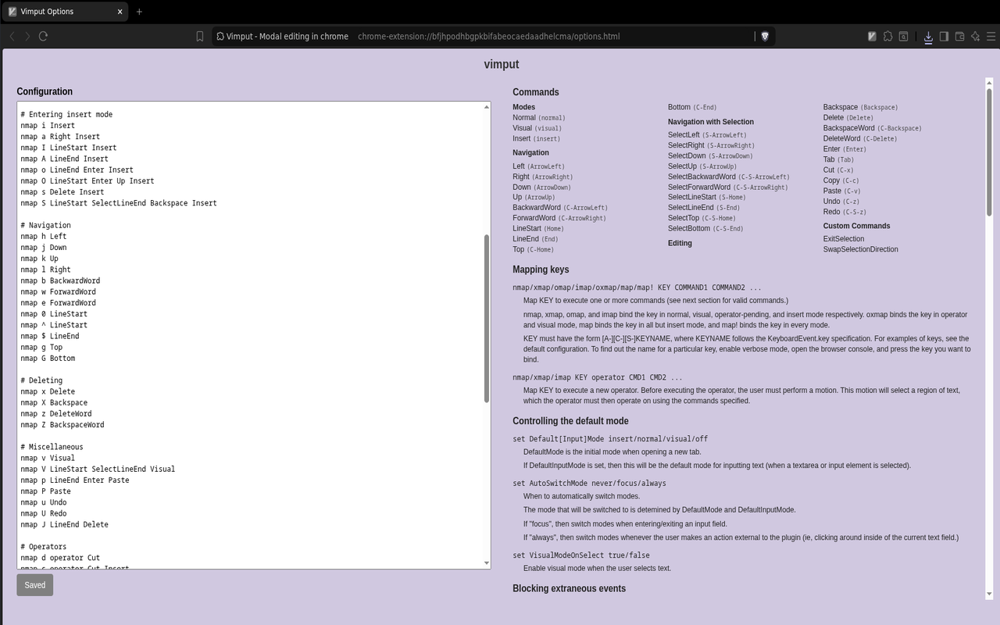

# vimput

Simulate arrow keys and text editing keys using vim-style bindings.

Since vimput simulates the browser's built-in text editing keys, it
should natively work on all websites which allow arrow key navigation.
This includes websites like Google Docs, which implement their own
custom text rendering, websites like notion, where text is split
across elements, and even websites where you are editing more than
text, such as google sheets.

By default, the extension starts in "off" mode, and switches to
"insert" mode whenever a text field is selected (but this behavior can
be customized). Since `Escape` is already used by the browser, `Alt+q`
(or `Control+q` for MacOS) is the default keybinding to enter normal
mode. Once in normal mode, you will be able to use many of vim's
default keybindings.

## Supported Commands

Currently supported normal mode commands are:
- Numeric prefixes for repeating any command
- `h/j/k/l` for basic navigation
- `w/e/b` for wordwise navigation
- `$/^/0` to jump to the start/end of the line
- `g/G` to jump to the start/end of the document
- `d/c/y` to read a motion, then perform a delete/change/copy
- `D/C/Y` to perform a delete/change/copy on the current line
- `i/a` to enter insert mode
- `I/A` to enter insert mode at the start/end of the line
- `o/O` to open a new line below/above, and then entering insert mode
- `s/S` to delete the current character/line and enter insert mode
- `x/X` to delete forward/backward
- `z/Z` to delete a word forward/backward
- `u/U` to undo/redo
- `J` to merge the next line with the current line
- `v` to enter visual mode
- `V` to select the current line and enter visual mode

Currently supported visual mode commands are:
- `h/j/k/l/w/e/b/$/^/0/g/G` to move the selection
- `d/c/y` to delete/change/copy the selected text
- `o` to swap the selection direction (visual mode)
- `q/A-q` to exit visual mode at the spot of the cursor
- `i/a` to enter insert mode at the beginning/end of the selection

The full list of keybindings and settings can be viewed and customized
in the options menu once the extension is installed.

## Disabling the debug popup

In order to simulate native keybindings, vimput must use chrome's
debugger api. This has the delightful feature of providing you with a
popup at the top of your screen every time the extension is used. In
order to disable this popup, you must run chrome with the
`--silent-debugger-extension-api` flag. See
(this)[https://www.chromium.org/developers/how-tos/run-chromium-with-flags/]
article on how to run chrome with custom flags.

For brave users: This flag does not seem to work on the standard
version of brave, but it does work on the beta version.

## Macos limitations

MacOS does not allow simulating any events which have the Command
prefix. Luckily, this only eliminates the beginning/end of file keys,
and command shortcuts (cut, copy, paste, undo redo.) Due to this, `d`
is mapped to Backspace on MacOS instead of Cut.

Also, MacOS will sometimes infer Option+key as a special character
instead of the raw key combination.

## Implementation

The extension is implemented by intercepting all keyboard events and
replacing them with new ones. For example, if you press the l key
while in normal mode, the extension will intercept it, and then send
the page an ArrowRight event in its place. Similarly, if you were in
visual mode, it would send a Shift+ArrowRight event in order to expand
the selection to the right.

This should give a general idea of what the extension is and is not
capable of. For example, it is possible to simulate `0` by pressing
`Home`, but there is no way to simulate the `^` key, since the browser
does not have a key to jump to the beginning of a line's text. The
extension then implements repeated keys by simply performing the
associated key presses a bunch of times.

The motion/operator system is a special case. When you press an
operator, the extension will wait for the user to input a valid
motion. The motion will then be run first, and select a region of
text. The operator will then act on the selected text. For example, if
you press `dd`, the extension will send `Home` to go to the beginning
of the line, `Shift+End` to select to the end of the line, and finally
`Control+x` to cut that region. Thus, if you wanted to remap `d` to
simply delete instead of cut, you could write `nmap d operator
Backspace` in your config. Since `Backspace` deletes whatever text is
selected, it will work as an operator.

# Configuration

Almost every aspect of the extension can be configured in the
configuration file, which can be accessed by clicking on the extension
icon. You can also provide site-specific configuration, including
disabling the extension entirely on certain sites.

